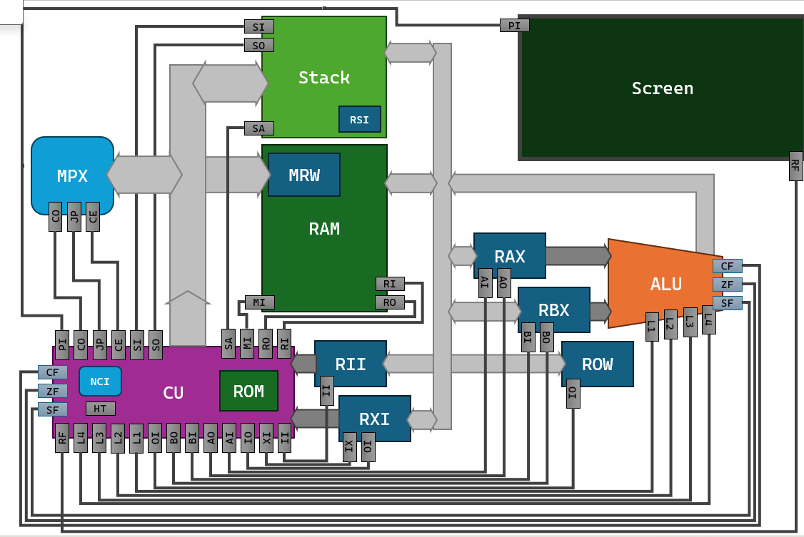

# SBB Computer - 8-bit CPU Simulation

## Overview
SBB Computer is an **8-bit computer simulation in Python** featuring a custom CPU architecture inspired by [Ben Eater's 8-bit CPU](https://eater.net/8bit). It includes:
- A **custom assembly language (SBBasm)**
- A **compiler for a custom high-level language (SBB lang)**
- A **graphical display** using Pygame
- **Keyboard input** for interactivity

## Features
- **Variable-length instructions**: Some instructions are 1-byte, others 2-bytes, optimizing memory usage while maximizing the number of available instructions.
- **Single general-purpose register** (`rax`) with a support register (`rbx`) for temporary storage.
- **Limited RAM (4kB) and a 256-byte call stack**.
- **Screen and keyboard input** integrated via Pygame.
- **Debugger** for stepping through SBBasm instructions.
- **Highly optimized compiler**: Can reduce machine code size by 10% to 200%.

## Technical Details
### CPU Architecture

The CPU operates primarily with a **single general-purpose register (`rax`)**, while a support register (`rbx`) aids in operations like arithmetic. The instruction set consists of three categories:



#### Memory & Control Instructions
- `lda`, `add`, `sub`, `sta`, `jsr`, `jmp`, `jmpc`, `jmpz`, `jmpn`, `and`, `or`, `cmp`, `multl`, `multh`, `jpne`, `jpeq`, `jplt`, `jpgt`

#### Immediate Value Instructions
- `ldi`, `add#`, `sub#`, `and#`, `or#`, `ldib`, `multl#`, `multh#`, `push#`, `xor#`, `ret#`, `cmp#`, `halt#`

#### Operand-Free Instructions
- `noop`, `out`, `inc`, `dec`, `rsh`, `lsh`, `take`, `push`, `pop`, `move`, `ret`, `addc`, `not`, `refr`, `subc`, `halt`

### SBBasm (Assembly Language)
SBBasm follows a structure similar to other assembly languages, featuring:
- **Global and local labels**
- **Heap pre-allocation**
- **Variable initialization**
- **Integrated debugger** for step-by-step execution

### SBB lang (High-Level Language)
SBB lang is a **C-like language** that compiles into SBBasm. Features include:
- **Standard library** (currently small, but expanding)
- **Comprehensive error reporting** (syntax errors, type mismatches, undeclared variables, etc.)
- **Powerful optimizer**, reducing machine code size significantly (10% to 200%)

## Installation & Usage
### Prerequisites
- `python3`
- `pygame`

### Running the Simulation
Clone the repository and run:
```bash
python3 sbb.py
```
This will display the available options.

### Example Program
To run a **Hello World** program with visuals:
```bash
python3 sbb.py "./sbb_lang_files/helloworld.py" -runv
```

## Development & Learning
### Challenges Faced
- Debugging the compiler was difficult since errors could originate from **anywhere in the code generation, optimizer, assembler, or CPU.**

### Key Learnings
- Object-oriented programming in Python
- Deep understanding of CPU architecture, assembly language, and compiler design

## Future Improvements
Planned features for the compiler:
- **Basic types**
- **Structs**
- **Arrays**

## Contribution & Licensing
- Contributions **are not** open to the public.
- Licensed under the **MIT License** – free to use.

---
This project is a personal endeavor to deepen my understanding of computer architecture and compiler design. 🚀